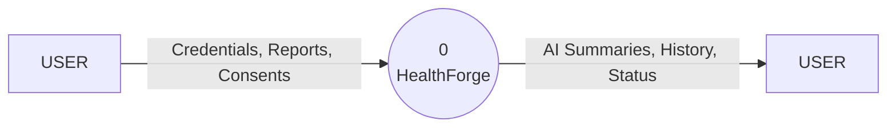
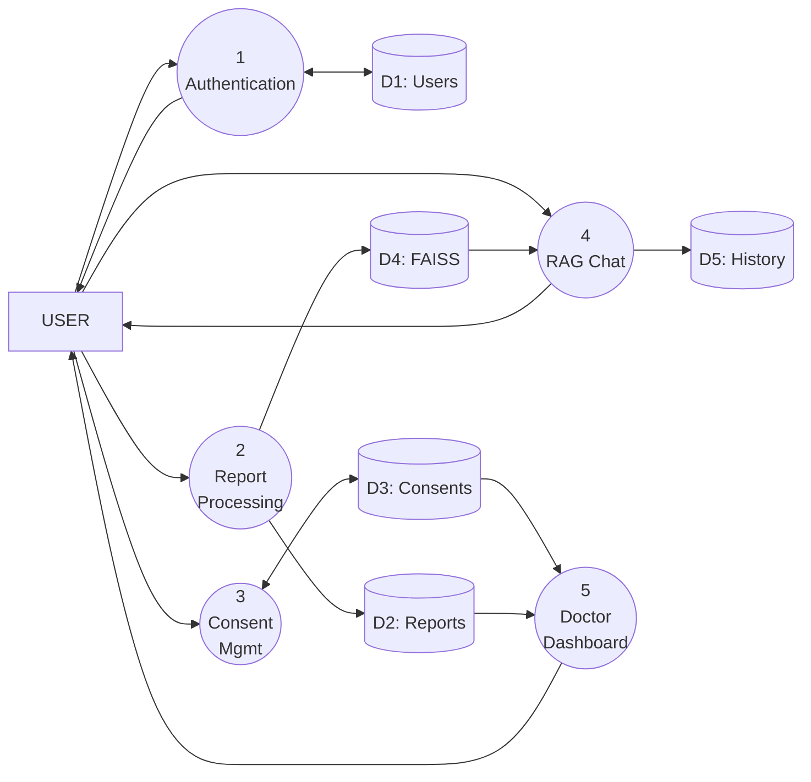
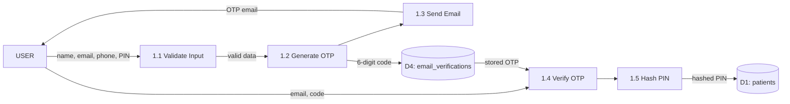
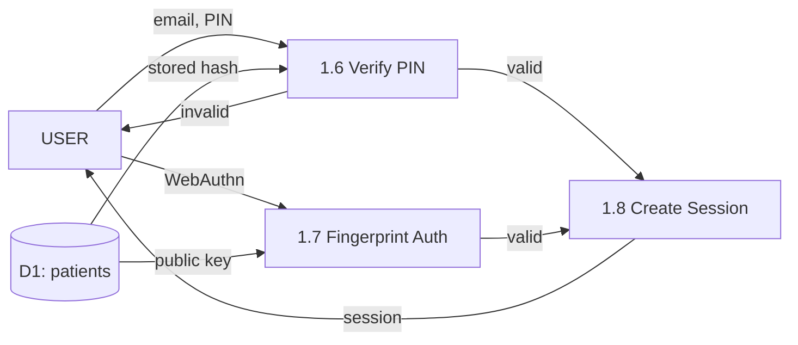
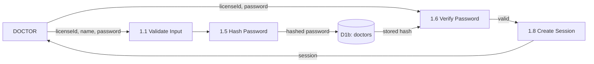
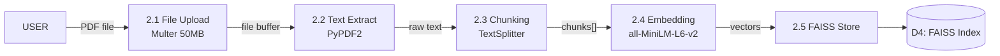
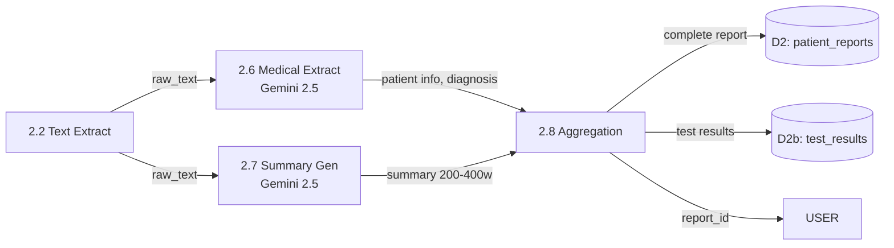
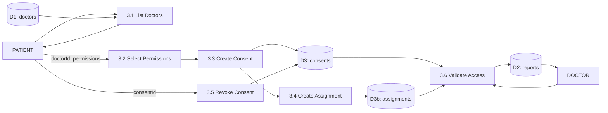
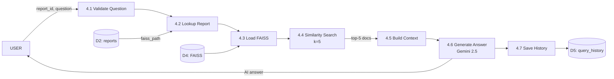
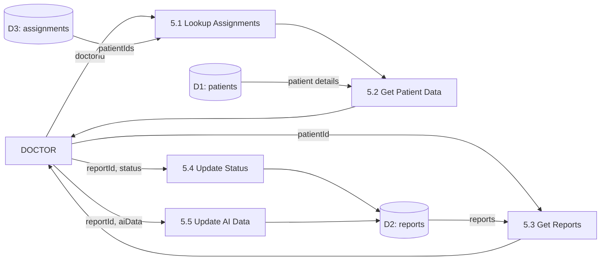

# 🏥 HealthForge - Data Flow Diagrams (DFD)

This document provides complete Data Flow Diagrams for the HealthForge Health Records Management Platform.

---

## DFD Notation Legend

| Symbol | Meaning |
|--------|---------|
| **Rectangle** | External Entity (User, External System) |
| **Circle** | Process (numbered for identification) |
| **Open Rectangle** | Data Store (prefixed with D1, D2, etc.) |
| **Arrow** | Data Flow (labeled with data name) |

---

## DFD (Level: 0) - Context Diagram

The Level 0 DFD (Context Diagram) represents the entire HealthForge system as a single process, illustrating its interaction with external entities. Users (both Patients and Doctors) provide **Authentication Credentials**, **Medical Report PDFs**, and **Consent Requests** as inputs to the system. The system processes these inputs and returns **AI-Generated Summaries**, **Report History**, and **Authentication Status** as outputs. This high-level view establishes the system boundary and identifies all external data flows.

---

## DFD (Level: 1) - Main System Processes

The Level 1 DFD decomposes the HealthForge system into five primary functional modules that handle authentication, data processing, consent management, AI-powered Q&A, and doctor workflows:

1. **User Authentication Module**: Receives **Authentication Credentials** (email/PIN for patients, licenseId/password for doctors, or WebAuthn fingerprint data) from the user, validates them against the MySQL database using bcrypt hashing, and returns the **Authentication Status** along with session tokens.

2. **Report Processing & AI Analysis Module**: Accepts **Medical Report PDFs** uploaded by patients, extracts text using PyPDF2, generates vector embeddings using HuggingFace (all-MiniLM-L6-v2), stores them in FAISS for semantic search, and utilizes Google Gemini 2.5 Flash to extract structured medical information and generate comprehensive AI summaries.

3. **Consent Management Module**: Processes **Consent Requests** from patients to grant or revoke access permissions (READ/WRITE/SHARE) to specific doctors, creates doctor-patient assignments, and validates access when doctors attempt to view patient reports.

4. **RAG Chat Module**: Accepts **Natural Language Questions** about medical reports, performs similarity search against the FAISS vector store to retrieve relevant document chunks, and uses Google Gemini with LangChain to generate contextual **AI Answers** based on the report content.

5. **Doctor Dashboard Module**: Enables doctors to view their **Assigned Patients**, access consented patient reports with AI-generated insights, and update report status (reviewed/archived) for workflow management.

---

## DFD (Level: 2) - Process 1: User Authentication

The Level 2 DFD for User Authentication decomposes the authentication module into eight sub-processes: **Input Validation** (1.1) validates user data using regex patterns; **OTP Generation** (1.2) creates 6-digit verification codes; **Email Sending** (1.3) delivers OTPs via SMTP; **OTP Verification** (1.4) validates codes against stored records; **PIN/Password Hashing** (1.5) secures credentials using bcrypt; **Credential Verification** (1.6) compares hashes for login; **Fingerprint Auth** (1.7) handles WebAuthn biometric authentication; and **Session Creation** (1.8) generates session tokens for authenticated users.

### 1A. Patient Registration Flow

### 1B. Patient Login Flow

### 1C. Doctor Authentication Flow

---

## DFD (Level: 2) - Process 2: Report Processing & AI

The Level 2 DFD for Report Processing decomposes into eight sub-processes: **File Upload** (2.1) handles PDF ingestion via Multer (50MB limit); **Text Extraction** (2.2) uses PyPDF2 to extract raw text; **Chunking** (2.3) splits text using RecursiveCharacterTextSplitter; **Embedding** (2.4) generates 768-dimensional vectors using HuggingFace all-MiniLM-L6-v2; **FAISS Store** (2.5) creates and saves vector indexes; **Medical Extraction** (2.6) uses Gemini 2.5 Flash to extract patient info, diagnosis, and test results; **Summary Generation** (2.7) produces 200-400 word AI summaries; and **Data Aggregation** (2.8) combines all extracted data for storage.

### 2A. PDF Upload & Text Extraction

### 2B. AI Analysis Pipeline

---

## DFD (Level: 2) - Process 3: Consent Management

The Level 2 DFD for Consent Management handles the role-based access control between patients and doctors through six sub-processes: **Doctor Listing** (3.1) retrieves available doctors; **Permission Selection** (3.2) allows patients to choose READ/WRITE/SHARE permissions; **Consent Creation** (3.3) stores permission grants in the database; **Assignment Creation** (3.4) links doctors to patients; **Consent Revocation** (3.5) deactivates existing permissions; and **Access Validation** (3.6) verifies doctor access rights before serving patient reports.

---

## DFD (Level: 2) - Process 4: RAG Chat

The Level 2 DFD for RAG Chat implements Retrieval-Augmented Generation through seven sub-processes: **Question Validation** (4.1) ensures queries meet minimum length requirements; **Report Lookup** (4.2) retrieves the FAISS index path for the target report; **FAISS Loading** (4.3) loads the vector store into memory; **Similarity Search** (4.4) finds the top-5 most relevant document chunks; **Context Building** (4.5) assembles the prompt with retrieved context; **Answer Generation** (4.6) uses Gemini 2.5 with LangChain's QA chain to produce responses; and **History Storage** (4.7) persists Q&A pairs for future reference.

---

## DFD (Level: 2) - Process 5: Doctor Dashboard

The Level 2 DFD for Doctor Dashboard enables healthcare providers to manage their patient caseload through five sub-processes: **Assignment Lookup** (5.1) retrieves patients assigned to the doctor; **Patient Data Retrieval** (5.2) fetches patient demographics; **Report Retrieval** (5.3) loads patient medical reports with AI-generated insights; **Status Update** (5.4) allows marking reports as reviewed or archived; and **AI Data Update** (5.5) enables updating AI-extracted fields if corrections are needed.

---

## Data Store Reference

| ID | Table | Description |
|----|-------|-------------|
| D1 | `patients` | Patient accounts (bcrypt PIN) |
| D1b | `doctors` | Doctor accounts (bcrypt password) |
| D2 | `patient_reports` | Reports with AI data |
| D2b | `test_results` | Individual test results |
| D3 | `consents` | Access permissions (JSON) |
| D3b | `assignments` | Doctor-patient links |
| D4 | `email_verifications` | OTP records |
| D5 | `FAISS indexes` | Vector embeddings |
| D6 | `query_history` | RAG chat history |

---

## Process Reference

| ID | Name | Technology | Port |
|----|------|------------|------|
| 1.1 | Input Validation | regex | 5001 |
| 1.2 | OTP Generation | random | 5001 |
| 1.3 | Email Sending | SMTP | 5001 |
| 1.4 | OTP Verification | MySQL | 5001 |
| 1.5 | PIN/Password Hashing | bcrypt | 5001 |
| 1.6 | PIN/Password Verify | bcrypt | 5001 |
| 1.7 | Fingerprint Auth | WebAuthn | 5001 |
| 1.8 | Session Creation | Express | 5000 |
| 2.1 | File Upload | Multer | 5000 |
| 2.2 | Text Extraction | PyPDF2 | 8004 |
| 2.3 | Text Splitting | LangChain | 8004 |
| 2.4 | Embedding | HuggingFace | 8004 |
| 2.5 | Vector Store | FAISS | 8004 |
| 2.6 | Medical Extraction | Gemini 2.5 | 8004 |
| 2.7 | Summary Generation | Gemini 2.5 | 8004 |
| 2.8 | Data Aggregation | Python | 8004 |
| 3.1-3.6 | Consent Operations | Flask | 5001 |
| 4.1-4.7 | RAG Operations | Flask+FAISS | 5001 |
| 5.1-5.5 | Doctor Operations | Flask | 5001 |

---

## API Endpoints

### Flask Backend (Port 5001)
- `POST /api/patients/register` - Registration
- `POST /api/patients/verify-email` - OTP verify
- `POST /api/patients/login` - Login
- `POST /api/patients/fingerprint/*` - Biometric
- `POST /api/doctors/register` - Doctor register
- `POST /api/doctors/login` - Doctor login
- `POST /api/consents` - Create consent
- `POST /api/consents/:id/revoke` - Revoke
- `POST /api/chat/ask` - RAG Q&A

### Flask AI Service (Port 8004)
- `POST /api/report/summary` - Full processing
- `POST /api/report/extract` - Extract only
- `POST /api/report/summarize` - Summary only

### Express Server (Port 5000)
- `POST /api/patients/:id/reports/upload` - Upload
- `GET /api/doctors/:id/patients` - Get patients
- `PUT /api/reports/:id/status` - Update status

---

*Generated for HealthForge - AI-Powered Health Records Management System*
