# HealthForge - Paper Figures (For Screenshots)

Use these Mermaid diagrams to take screenshots for the IEEE paper figures.

---

## Figure 1: System Architecture
**File: fig_architecture.png**

---

## Figure 2: FHE Authentication Protocol
**File: fig_fhe_auth.png**

```mermaid
sequenceDiagram
    participant C as Client Browser
    participant W as WebAuthn API
    participant S as Server :5001
    participant DB as MySQL
    
    Note over C,DB: Registration Phase
    C->>W: Capture Fingerprint
    W->>C: Feature Vector f_reg ∈ R^512
    C->>C: Generate CKKS Keys (pk, sk)
    C->>C: ct_reg = Enc_pk(f_reg)
    C->>S: Store (user_id, pk, ct_reg)
    S->>DB: INSERT encrypted template
    
    Note over C,DB: Authentication Phase
    C->>W: Capture Fingerprint
    W->>C: Feature Vector f_auth
    C->>C: ct_auth = Enc_pk(f_auth)
    C->>S: Send ct_auth
    S->>DB: Fetch (pk, ct_reg)
    S->>S: ct_sim = HomomorphicCosine(ct_reg, ct_auth)
    S->>C: Return ct_sim
    
    Note over C,DB: Verification Phase
    C->>C: sim = Dec_sk(ct_sim)
    alt sim > 0.85
        C->>S: Signed Confirmation
        S->>C: Session Token
    else sim <= 0.85
        C->>C: Auth Failed
    end
```

---

## Figure 3: RAG Pipeline
**File: fig_rag_pipeline.png**

---

## FastSAM Quantized Pipeline DFD (4+3 Horizontal Layout)

---

## Figure 4: Consent Management Flow
**File: fig_consent.png**

---

## Figure 5: Patient Dashboard
**File: fig_dashboard.png**

> **NOTE:** For this figure, take an actual screenshot of your running application's patient dashboard showing:
> - Report list with AI summaries visible
> - Health timeline visualization
> - Upload report button
> - Consent management section

---

## How to Screenshot

1. Open this file in VS Code or any Markdown preview that renders Mermaid
2. Take screenshots of each diagram
3. Save with the corresponding filename:
   - `fig_architecture.png`
   - `fig_fhe_auth.png`
   - `fig_rag_pipeline.png`
   - `fig_consent.png`
   - `fig_dashboard.png` (from running app)
4. Place in the same folder as the `.tex` file
5. Compile with: `pdflatex HealthForge_IEEE_Paper.tex`
