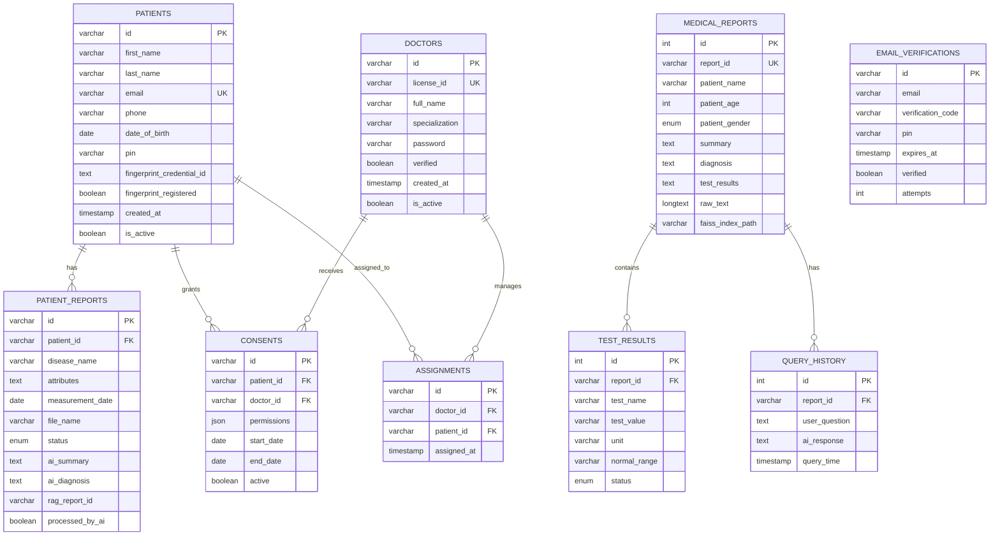

# 🏥 HealthForge - UML Architecture Diagrams

This document provides comprehensive Context, Use Case, and Sequence diagrams for the HealthForge Health Records Management Platform.

---

## 1. Context Diagram

```mermaid
flowchart TB
    subgraph External["External Services"]
        MySQL[(MySQL<br/>medical_reports_db)]
        FAISS[(FAISS<br/>Vector Store)]
        Gemini[Google Gemini 2.5<br/>LLM API]
        HuggingFace[HuggingFace<br/>Embeddings]
    end
    
    subgraph Users["Users"]
        Patient[🧑‍⚕️ Patient]
        Doctor[👨‍⚕️ Doctor]
    end
    
    subgraph HealthForge["HealthForge Platform"]
        Core[🏥 HealthForge<br/>AI-Powered Health Records<br/>Management System]
    end
    
    Patient -->|Register/Login with PIN<br/>Upload medical reports<br/>View AI summaries<br/>Manage consents| Core
    Doctor -->|Register with License ID<br/>View assigned patients<br/>Access shared reports<br/>Review AI insights| Core
    
    Core <-->|Store/Query<br/>patients, doctors,<br/>reports, consents| MySQL
    Core <-->|Vector search<br/>RAG Q&A| FAISS
    Core <-->|Extract medical info<br/>Generate summaries<br/>Answer questions| Gemini
    Core <-->|Text embeddings<br/>for RAG| HuggingFace
```

---

## 2. System Architecture Diagram

---

## 3. Use Case Diagram

```mermaid
flowchart LR
    subgraph Actors["Actors"]
        Patient((🧑‍⚕️ Patient))
        Doctor((👨‍⚕️ Doctor))
        System((⚙️ System))
    end
    
    subgraph Authentication["Authentication"]
        UC1([Register with Email])
        UC2([Verify Email OTP])
        UC3([Login with PIN])
        UC4([Fingerprint Auth])
        UC5([Doctor Register])
        UC6([Doctor Login])
    end
    
    subgraph ReportManagement["Medical Report Management"]
        UC7([Upload PDF Report])
        UC8([View Report History])
        UC9([View AI Summary])
        UC10([Download Report])
        UC11([Delete Report])
    end
    
    subgraph AIFeatures["AI Features"]
        UC12([Extract Patient Info])
        UC13([Generate Summary])
        UC14([View Key Findings])
        UC15([Chat with Report])
        UC16([Get Recommendations])
    end
    
    subgraph ConsentManagement["Consent Management"]
        UC17([Grant Doctor Access])
        UC18([Set Permissions])
        UC19([Revoke Consent])
        UC20([View Active Consents])
    end
    
    subgraph DoctorFeatures["Doctor Features"]
        UC21([View Assigned Patients])
        UC22([Access Patient Reports])
        UC23([View AI Insights])
        UC24([Mark Report Reviewed])
        UC25([Archive Report])
    end
    
    subgraph SystemOperations["System Operations"]
        UC26([Process PDF])
        UC27([Create Vector Store])
        UC28([Generate Embeddings])
        UC29([Store in MySQL])
    end
    
    Patient --> UC1 & UC2 & UC3 & UC4
    Patient --> UC7 & UC8 & UC9 & UC10 & UC11
    Patient --> UC15 & UC16
    Patient --> UC17 & UC18 & UC19 & UC20
    
    Doctor --> UC5 & UC6
    Doctor --> UC21 & UC22 & UC23 & UC24 & UC25
    
    System --> UC12 & UC13 & UC14
    System --> UC26 & UC27 & UC28 & UC29
    
    UC7 -.->|triggers| UC26
    UC26 -.->|includes| UC12
    UC26 -.->|includes| UC13
    UC26 -.->|includes| UC27
    UC15 -.->|requires| UC27
    UC22 -.->|requires| UC17
```

---

## 4. Detailed Use Case Descriptions

| Use Case ID | Name | Actor | Description |
|-------------|------|-------|-------------|
| UC1 | Register with Email | Patient | Create account with email, phone, DOB, and 6-digit PIN |
| UC2 | Verify Email OTP | Patient | Verify email with 6-digit OTP sent via SMTP |
| UC3 | Login with PIN | Patient | Access dashboard using email and PIN |
| UC4 | Fingerprint Auth | Patient | WebAuthn-based biometric login |
| UC5 | Doctor Register | Doctor | Create account with license ID and specialization |
| UC6 | Doctor Login | Doctor | Access dashboard with license ID and password |
| UC7 | Upload PDF Report | Patient | Upload medical report PDF for AI processing |
| UC9 | View AI Summary | Patient | View AI-generated summary of medical report |
| UC15 | Chat with Report | Patient | Ask questions about report using RAG |
| UC17 | Grant Doctor Access | Patient | Share reports with specific doctors |
| UC22 | Access Patient Reports | Doctor | View reports from consented patients |

---

## 5. Sequence Diagrams

### 5.1 Patient Registration Sequence

### 5.2 Email Verification Sequence

### 5.3 Medical Report Upload with AI Processing

### 5.4 RAG Chat with Medical Report

### 5.5 Doctor-Patient Consent Flow

### 5.6 System Startup Sequence

### 5.7 PDF Processing Pipeline

---

## 6. Component Interaction Summary

---

## 7. Database Schema ER Diagram

---

## 8. Port Reference

| Service | Port | Technology | Description |
|---------|------|------------|-------------|
| React Frontend | 5000 | Vite + React | User Interface |
| Express API Gateway | 5000 | Node.js/Express | Main API routing |
| Flask Backend | 5001 | Python/Flask | User auth & data |
| Summary Service | 8004 | Python/Flask | AI summarization |
| RAG Service | 8001 | Python/FastAPI | RAG Q&A |

---

## 9. Technology Stack Summary

| Layer | Technologies |
|-------|-------------|
| **Frontend** | React 18, TypeScript, Vite, TailwindCSS, Radix UI, React Query, Recharts |
| **API Gateway** | Node.js, Express, Multer |
| **Backend** | Python, Flask, Flask-CORS, bcrypt |
| **AI/ML** | Google Gemini 2.5, LangChain, FAISS, HuggingFace, PyPDF2 |
| **Database** | MySQL 8.0, Drizzle ORM |
| **DevOps** | npm, Poetry, dotenv |

---

*Generated for HealthForge - AI-Powered Health Records Management System*
